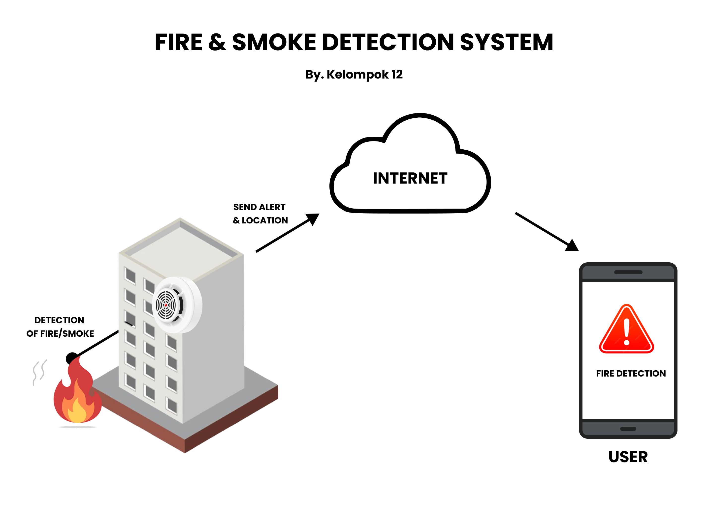

# 🔥 IoT Fire and Smoke Detector

Proyek ini merupakan bagian dari tugas kuliah Internet of Things (IoT) yang bertujuan untuk mendeteksi asap dan api menggunakan sensor dan mengirimkan peringatan beserta lokasi melalui internet. Proyek ini juga mendukung Tujuan Pembangunan Berkelanjutan (Sustainable Development Goals / SDG) nomor 11: **Sustainable Cities and Communities**.

## 🎯 Tujuan Proyek

- Mendeteksi asap dan/atau api di lingkungan sekitar menggunakan sensor MQ2 dan flame sensor.
- Mengirimkan peringatan (alert) ke pengguna secara real-time menggunakan internet.
- Menyertakan lokasi kejadian (opsional) melalui integrasi dengan Google Maps API.
- Mendukung kontrol dan monitoring jarak jauh melalui platform seperti IFTTT, Firebase, atau Blynk.

## 📦 Komponen yang Digunakan

| Komponen       | Fungsi                                  |
|----------------|------------------------------------------|
| ESP32          | Mikrokontroler utama (WiFi + kontrol)    |
| MQ2            | Sensor pendeteksi gas/asap               |
| Buzzer         | Menghasilkan bunyi sebagai alarm         |
| Flame Sensor   | Sensor pendeteksi api                    |
| Breadboard     | Perakitan sementara                      |
| Kabel jumper   | Koneksi antar komponen                   |
| IFTTT          | Pengiriman notifikasi otomatis           |
| Firebase/Blynk | (Opsional) Integrasi cloud & kontrol     |

## 🧱 Diagram Sistem Blok

Perangkat keras (sensor dan ESP32) → Internet → Platform Cloud (IFTTT, Firebase) → Pengguna (notifikasi / dashboard)

## 📅 Timeline Proyek

Proyek ini dilaksanakan dalam 7 minggu:
1. Ideasi dan perencanaan proyek
2. Pengadaan & pengujian komponen
3. Koneksi internet & cloud integration
4. Fitur kendali jarak jauh
5. Integrasi sistem dan optimasi
6. Finalisasi perangkat & uji lapangan
7. Dokumentasi, laporan, dan presentasi

Detail per minggu tersedia pada folder [`test/`](./test)

## 📁 Struktur Direktori

## 📜 Lisensi

Proyek ini dilisensikan di bawah MIT License. Silakan gunakan dan modifikasi dengan tetap memberikan atribusi.

---

📍 **Dibuat oleh Kelompok 12:**
1. Benony Gabriel (NIM: 105222002)
2. Senopati Baruna Pasha (NIM: 10522023)

**Universitas Pertamina, 2025**

